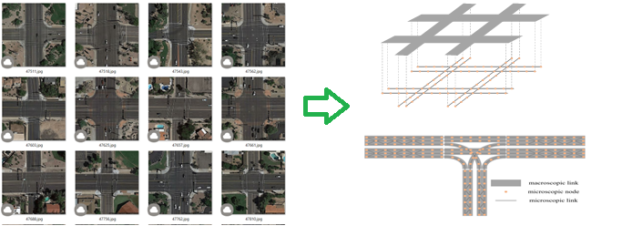
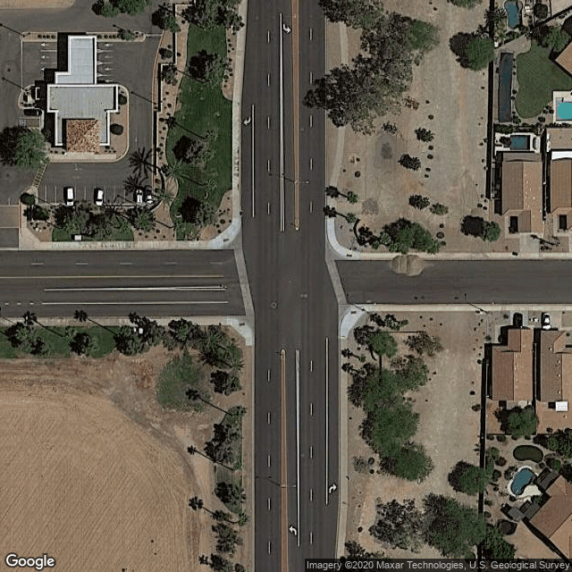
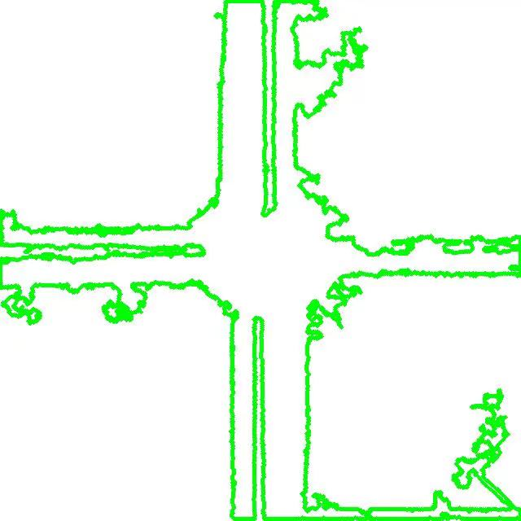
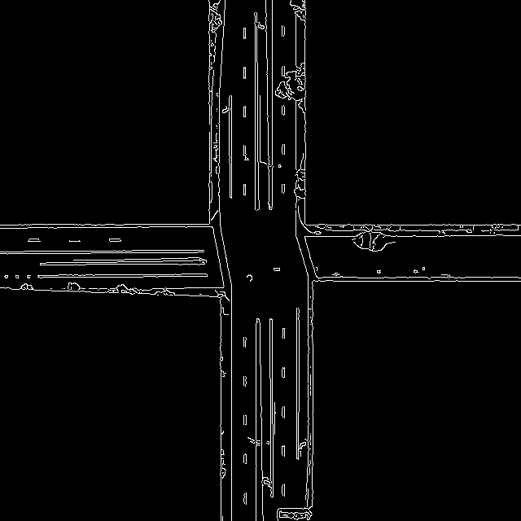

# img2net

Transportation networks are crucial for efficient traffic planning and
operation. However, obtaining accurate movement information at intersections is
often challenging and time-consuming. To address this issue, we propose a
machine learning-based approach that uses publicly accessible satellite images
from Google maps to automatically identify movement information for each
intersection.

Our approach involves developing a customized deep learning model to extract
movement information from satellite images. With this model, researchers can
easily generate movement information for all intersections in a given area
without relying on labor-intensive manual work.

To evaluate the effectiveness of our proposed method, we collected a large set
of intersection data in Arizona, US. Our results demonstrate that our approach
is highly accurate and efficient, making it an ideal solution for producing
movement information for intersection modeling and management tasks.

By leveraging the power of AI, our method offers a cost-effective and scalable
solution for improving transportation network data quality and efficiency. This
has the potential to significantly benefit traffic planning and operation tasks,
ultimately leading to better traffic management and improved traffic flow.

Team members: Patrick Jiang, Mustafa Gadah, Xuesong (Simon) Zhou at ASU

## Principle 1: Select gray pixels in the image and output the largest contour.

## 

## Principle 2: Define the ROI area (excluding non-road areas), and then perform edge detection on the road

Grayscale processing

ROI Defining

Edge detection

Erosion and dilation

In the context of image processing, "erosion" refers to the process of shrinking
the boundaries of foreground objects in an image, and "dilation" refers to the
process of expanding the boundaries of foreground objects. These operations are
commonly used in image processing for tasks such as noise reduction, edge
detection, and feature extraction
